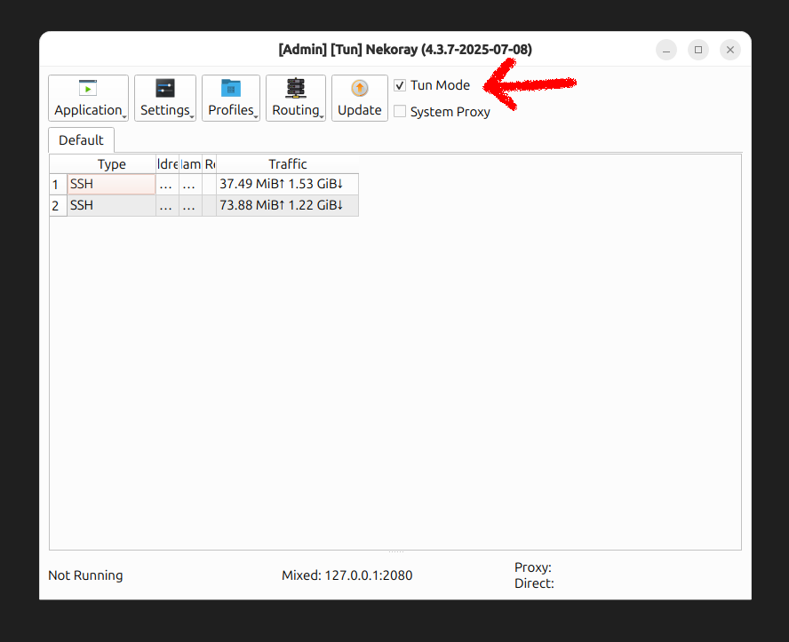

# NekoRay Installer

Easily install [NekoRay](https://github.com/Mahdi-zarei/nekoray) or [Throne](https://github.com/throneproj/Throne) on Linux and macOS with desktop shortcut support.
Supports backup, restore, and Wi-Fi hotspot tunneling through Nekoray.

---

## 📑 Table of Contents

1. [� Linux Installation](#-linux-installation)
2. [🍎 macOS Installation](#-macos-installation)
3. [🔐 Backup & Restore](#-backup--restore)
4. [📡 WiFi Hotspot Routing via NekoRay (Linux)](#-wifi-hotspot-routing-via-nekoray-linux)

---

## � Linux Installation

### ✅ Requirements (Debian-based distros)

```bash
sudo apt update && sudo apt install build-essential \
    libfontconfig1 \
    libqt5network5 \
    libqt5widgets5 \
    libqt5x11extras5 \
    libqt5gui5
```

### 🚀 Install NekoRay

```bash
wget -qO- https://raw.githubusercontent.com/ohmydevops/nekoray-installer/main/linux/installer.sh | bash
```

Creates a desktop shortcut and installs the latest release in your home directory.

### ❌ Uninstall NekoRay

```bash
wget -qO- https://raw.githubusercontent.com/ohmydevops/nekoray-installer/main/linux/uninstaller.sh | bash
```

Removes the installed files and shortcut.

---

## 🍎 macOS Installation

### ✅ Requirements

```bash
# Install Homebrew if not already installed
/bin/bash -c "$(curl -fsSL https://raw.githubusercontent.com/Homebrew/install/HEAD/install.sh)"

# Install required dependencies
brew install wget unzip
```

### � Install Throne (NekoRay for macOS)

```bash
curl -fsSL https://raw.githubusercontent.com/ohmydevops/nekoray-installer/main/mac/installer.sh | bash
```

Creates an application in `/Applications/Throne.app` and installs the latest release.

### ❌ Uninstall

```bash
curl -fsSL https://raw.githubusercontent.com/ohmydevops/nekoray-installer/main/mac/uninstaller.sh | bash
```

Removes the installed application and preferences.

---

## 🔐 Backup & Restore

### 🗄 Backup Config

**Linux:**
Backup your NekoRay config folder to a `.zip` file:

```bash
wget -qO- https://raw.githubusercontent.com/ohmydevops/nekoray-installer/main/linux/backup.sh | bash
```

**macOS:**
Backup your NekoRay or Throne config:

```bash
curl -fsSL https://raw.githubusercontent.com/ohmydevops/nekoray-installer/main/mac/backup.sh | bash
```

> This will create a file like `nekoray-backup-2025-07-17.zip` in the current directory.

### ♻️ Restore Config

**Linux:**
Restore your config from a backup zip:

```bash
bash <(wget -qO- https://raw.githubusercontent.com/ohmydevops/nekoray-installer/main/linux/restore.sh) path/to/backup.zip
```

**macOS:**
Restore your config from a backup zip:

```bash
curl -fsSL https://raw.githubusercontent.com/ohmydevops/nekoray-installer/main/mac/restore.sh | bash -s path/to/backup.zip
```

> It will replace your current config with the contents of the zip file.

---

## 📡 WiFi Hotspot Routing via NekoRay (Linux)

Tunnel all traffic from connected devices through Nekoray using a Wi-Fi hotspot.

### 🔧 Step 1: Enable Tun Mode

In the NekoRay GUI, go to `Settings` → enable **Tun Mode**:



---

### 📶 Start Hotspot

```bash
wget -qO- https://raw.githubusercontent.com/ohmydevops/nekoray-installer/main/linux/hotspot-on.sh | bash

```

Creates a Wi-Fi hotspot and redirects traffic through the VPN tunnel.

---

### 📴 Stop Hotspot

```bash
wget -qO- https://raw.githubusercontent.com/ohmydevops/nekoray-installer/main/linux/hotspot-off.sh | bash
```

Turns off the hotspot and restores previous settings.

> These scripts rely on `nmcli`. Ensure **NetworkManager** is installed and active.

---
